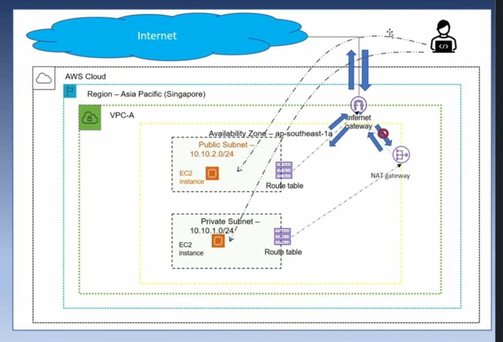
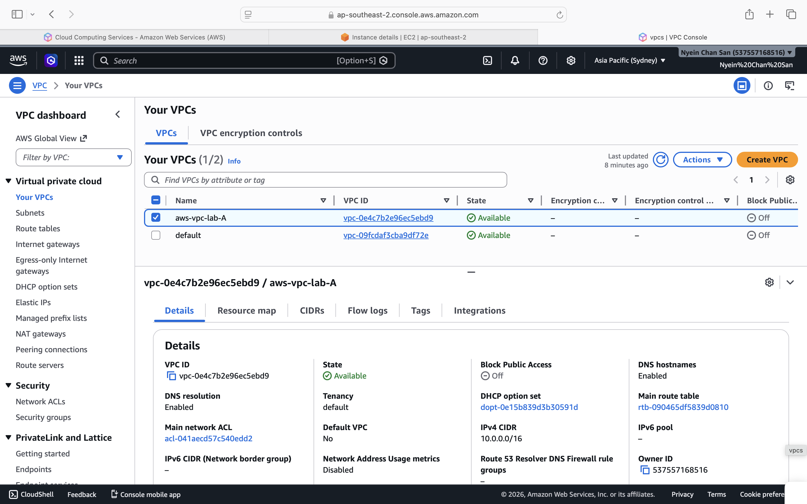

# aws-vpc-bastion-host-lab

## Overview

This project demonstrates how to securely access a private EC2 instance through a Bastion Host located in a public subnet inside a custom AWS VPC.

## Architecture

Internet
    |
    v
+-------------------+
| Internet Gateway  |
+-------------------+
          |
          v
+-------------------+
| Public Subnet     |
| Bastion Host EC2  |
+-------------------+
          |
          | SSH
          v
+-------------------+
| Private Subnet    |
| Private EC2       |
+-------------------+## Components

### VPC
- Custom VPC
- CIDR Block: 10.0.0.0/16

### Public Subnet
- Public EC2 (Bastion Host)
- Auto-assign Public IP enabled
- Route to Internet Gateway

### Private Subnet
- Private EC2
- No Public IP
- Accessible only through Bastion Host

### Security Groups
- Public EC2:
  - SSH (22) allowed from my IP

- Private EC2:
  - SSH (22) allowed from Bastion Host

## SSH Access Flow

### Step 1: Connect to Bastion Host

ssh -i key.pem ec2-user@PUBLIC_IP### Step 2: Connect to Private EC2

ssh -i key.pem ec2-user@PRIVATE_IP## Skills Practiced

- AWS VPC
- Public and Private Subnets
- Internet Gateway
- Route Tables
- Security Groups
- EC2 Instances
- Bastion Host Architecture
- SSH Access
- SCP File Transfer

## Screenshots

Screenshots are available in the screenshots folder.

## Lessons Learned

- Difference between public and private subnets
- How Bastion Hosts improve security
- Route table configuration
- Security Group management
- SSH troubleshooting

## Challenges Faced

### Issue 1: Public EC2 not reachable
Cause:
- Route table was not configured correctly.

Solution:
- Added a route to the Internet Gateway.

### Issue 2: SSH Permission Denied
Cause:
- PEM key was not available on the Bastion Host.

Solution:
- Copied the PEM file using SCP and corrected permissions.
  
## Author

Chan
AWS Networking Practice Lab
